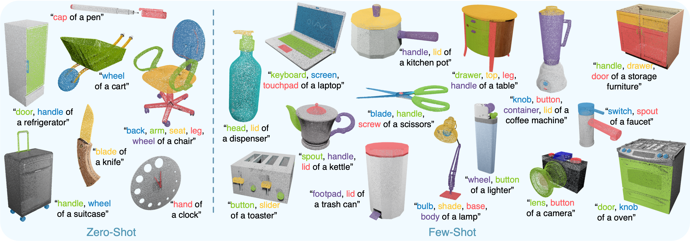
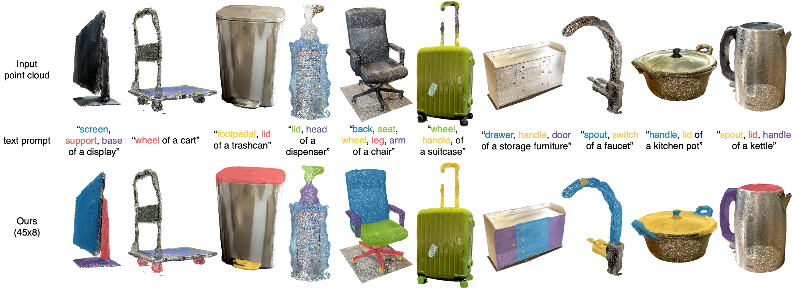

# PartSLIP
Official implementation of "PartSLIP: Low-Shot Part Segmentation for 3D Point Clouds via Pretrained Image-Language Models" (CVPR2023) [[PDF](https://arxiv.org/pdf/2212.01558.pdf)]

We explore a novel way for low-shot part segmentation of 3D point clouds by leveraging a pretrained image-language model (GLIP). We show that our method enables excellent zero-shot 3D part segmentation. Our few-shot version not only outperforms existing few-shot approaches by a large margin but also achieves highly competitive results compared to the fully supervised counterpart. Furthermore, we demonstrate that our method can be directly applied to iPhone-scanned point clouds without significant domain gaps.


<p align="center">

results on PartNetE dataset
</p>

<p align="center">

results on iPhone-scanned real point clouds
</p>


## Installation

Build the docker image
```
docker build -f docker/Dockerfile -t partslip:latest .
```
Note that GLIP and superpoint are installed within the docker image.
Then start the docker container with
```
docker run -it partslip:latest /bin/bash
```

## Quick-Demo
### Download pretrained checkpoints
Please download the pre-trained GLIP checkpoint ([glip_large_model.pth](https://huggingface.co/GLIPModel/GLIP/blob/main/glip_large_model.pth)) to `models/` for zero-shot inference. 

Within the docker container
```
wget -P models https://huggingface.co/GLIPModel/GLIP/resolve/main/glip_large_model.pth
```
The pre-trained [few-shot checkpoints](https://huggingface.co/datasets/minghua/PartSLIP/tree/main/models) of each object category for few-shot inferences can be downloaded on huggingface. 
```
wget -P models https://huggingface.co/datasets/minghua/PartSLIP/resolve/main/models/Chair.pth
```

### Inference
After downloading the models within the docker container, run the inference with
```
python3 demo.py
```

## PartNet-Ensembled

The test and few_shot splits are hosted on [huggingface](https://huggingface.co/datasets/minghua/PartSLIP/tree/main/data).

The details to curate the dataset can be found in the paper (https://arxiv.org/abs/2212.01558). Here is the general procedure: 

1. Use open-source software [BlenderProc](https://github.com/DLR-RM/BlenderProc) to render 3D textured mesh from [PartNet](https://partnet.cs.stanford.edu/) and [PartNet-Mobility](https://sapien.ucsd.edu/browse) datasets to 6 views, including color, depth, normal, and part ids. Save camera poses for use in Step 2 for backprojection. Please refer to the BlenderProc procedure examples and follow the example for [ShapeNet rendering](https://github.com/DLR-RM/BlenderProc/tree/main/examples/datasets/shapenet).
2. Backproject those 2D views to point clouds with following attributes: color, normal, part id. 
 
The point clouds are used to train baseline point-cloud models for semantic and instance segmentation. 

For running PartSLIP 

3. Render point clouds from Step 2 above to 2D images using [Pytorch3D](https://github.com/facebookresearch/pytorch3d), then pass as input to [GLIP](https://github.com/microsoft/GLIP) for part detection. 

Semantic and instance part-labels of the point clouds are parsed from original PartNet and PartNet-Mobility through part ids. We only used a subset of the original part categories, which can be found in [PartNetE_meta.json](PartNetE_meta.json).


## Citation

If you find our code helpful, please cite our paper:

```
@article{liu2022partslip,
  title={PartSLIP: Low-Shot Part Segmentation for 3D Point Clouds via Pretrained Image-Language Models},
  author={Liu, Minghua and Zhu, Yinhao and Cai, Hong and Han, Shizhong and Ling, Zhan and Porikli, Fatih and Su, Hao},
  journal={arXiv preprint arXiv:2212.01558},
  year={2022}
}
```
